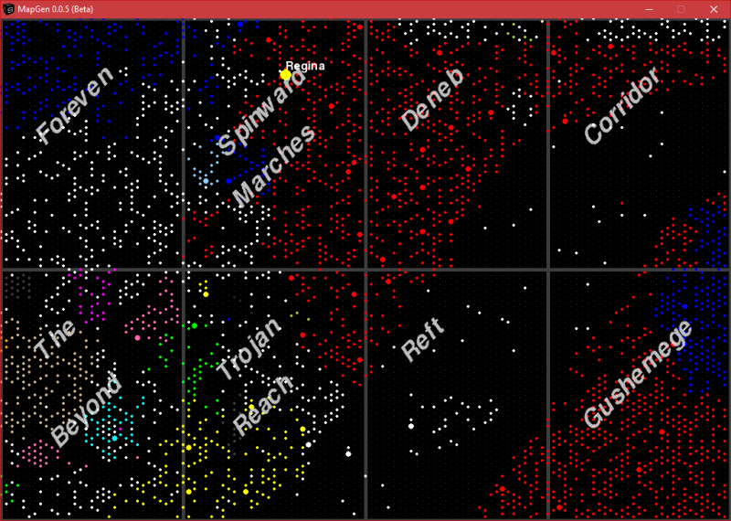
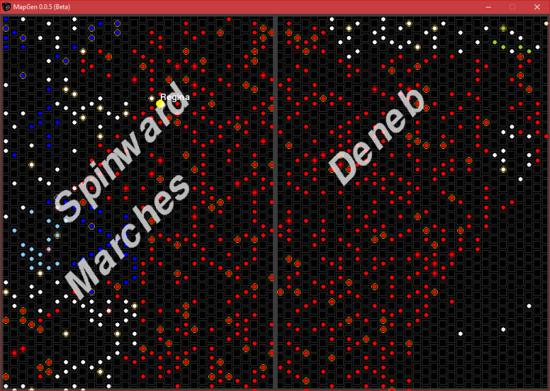
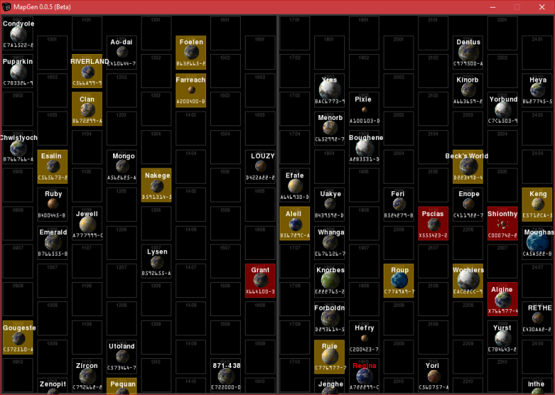
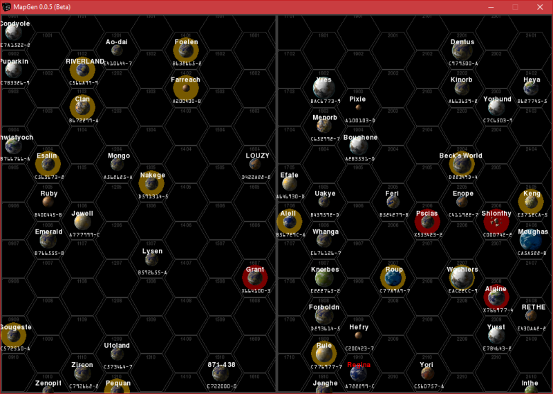

**MapGen 0.0.6b for Classic Python 2.5**
========================================

**MapGen** is a Classic Python 2.5 program for viewing Traveller RPG stellar maps.

.. figure:: images/mapgen_cover_art.png

The Traveller game in all forms is owned by Far Future Enterprises.
Copyright 1977 - 2020 Far Future Enterprises.
Traveller is a registered trademark of Far Future Enterprises.

Requirements
------------

* **Windows XP/7/8/10**

   Not functional in OSX or Linux.

* **pyttsx 1.1**

   MapGen speaks in Zira's voice (her voice comes with Windows). Can be changed to a different voice in the source.

* **colorama 0.2.7**

   Because CMD may have some colored text messages for debugging.
   
* **pygame 1.9.1release-svn2575**

   PyGame is used to draw the maps. It's basically a Python wrapper for SDL 1.2.13, which PyGame includes.

Warning
-------

**MapGen** will not work with **Python 2.6+**.

Usage
-----

Click on a sector to center it.

Dragging a sector (or pressing the arrow keys) will scroll the map.

The mouse wheel will zoom the map in and out while pointing.

Pressing **m** will toggle the computer's voice on/off.

Pressing **h** will flip to a hex map(s) at different zoom levels.

Pressing **r** will flip to a rectangle map.

Pressing **c** will toggle solid/clear travel zones while zoomed in.

Pressing **z** will toggle circle/hex/rectangle travel zones while zoomed in.

Pressing **t** will toggle world UWP/TC while zoomed in.

Pressing **l** will toggle the world system locations on/off.

Pressing **g** will toggle the hex/rectangle grid on/off.

Pressing **ESC** will exit the program.

Contact
-------
Questions? Please contact shawndriscoll@hotmail.com
