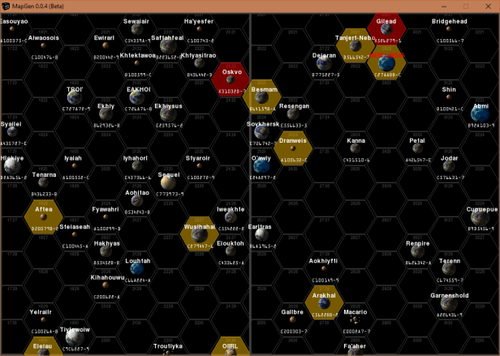

**MapGen 0.0.4b for Classic Python 2.5**
========================================

**MapGen** is a Classic Python 2.5 program for viewing Traveller RPG stellar maps.

The Traveller game in all forms is owned by Far Future Enterprises.
Copyright 1977 - 2019 Far Future Enterprises.
Traveller is a registered trademark of Far Future Enterprises.

Requirements
------------

* **Windows XP/7/8/10**

   Not functional in OSX or Linux.

* **pyttsx 1.1**

   MapGen speaks in Zira's voice (her voice comes with Windows). Can be changed to a different voice in the source.

* **colorama 0.2.7**

   Because CMD may have some colored text messages for debugging.
   
* **pygame 1.9.1release-svn2575**

   PyGame is used to draw the maps. It's basically a Python wrapper for SDL 1.2.13, which PyGame includes.

Warning
-------

**MapGen** will not work with **Python 2.6+**.

Contact
-------
Questions? Please contact shawndriscoll@hotmail.com
